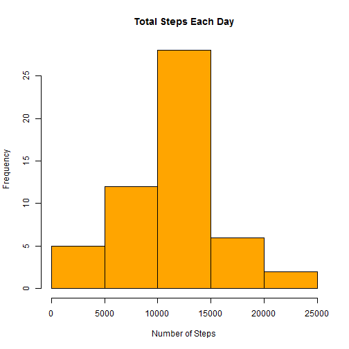
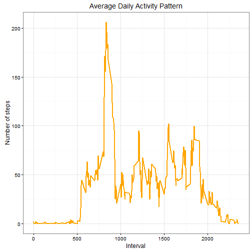
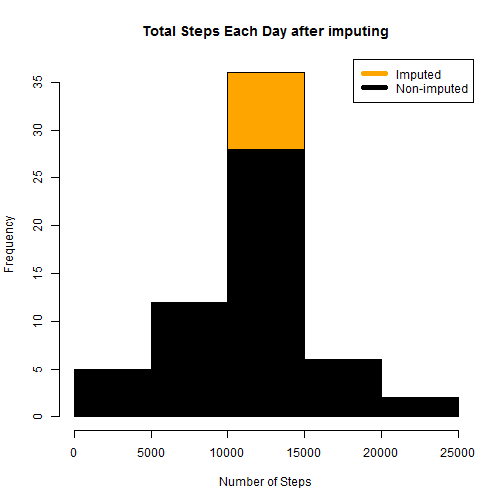
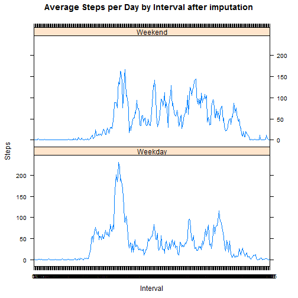

## Reproducible Research Project 1

This R Markdon document is written as a project submission.The project submission requirements are available in the [Read Me]("https://github.com/vslaser/Reproducible-Research/blob/master/README.md")

As shown in the readme file, the project consists of 9 deliverables. The project report is broken down into 9 sub headings below with text explaining the activity being performed and R code showing the code required to achieve the deiverable.

### Loading the required libraries

```r
library(knitr)
library(ggplot2)
library(mice)
```

```
## Loading required package: Rcpp
```

```
## mice 2.25 2015-11-09
```

```r
library(lattice)
```

### 1. Code for reading in the dataset and/or processing the data
The following code sets the working directory as my local directory. It then proceeds to download the file from the web address on assignment page. The file is then unzipped and then the data is read using "read.csv" to a data frame called acivity.

#### Reading the dataset

```r
setwd("D:\\DataScienceCoursera\\Reproducable Research")

temp<- tempfile()
download.file("https://d396qusza40orc.cloudfront.net/repdata%2Fdata%2Factivity.zip",temp)
unzip(temp)
unlink(temp)

activity <- read.csv("activity.csv")
str(activity)
```

```
## 'data.frame':	17568 obs. of  3 variables:
##  $ steps   : int  NA NA NA NA NA NA NA NA NA NA ...
##  $ date    : Factor w/ 61 levels "2012-10-01","2012-10-02",..: 1 1 1 1 1 1 1 1 1 1 ...
##  $ interval: int  0 5 10 15 20 25 30 35 40 45 ...
```

#### Processing the data

As seen above, the data field is a factor variable and the interval field is an integer variable. The below code is produced in order to process the data in preparation for the analysis. The code converts date variable to date type variable and interval variable into factor variable.


```r
activity$date <- as.Date(activity$date, format = "%Y-%m-%d")

activity$interval <- as.factor(activity$interval)

str(activity)
```

```
## 'data.frame':	17568 obs. of  3 variables:
##  $ steps   : int  NA NA NA NA NA NA NA NA NA NA ...
##  $ date    : Date, format: "2012-10-01" "2012-10-01" ...
##  $ interval: Factor w/ 288 levels "0","5","10","15",..: 1 2 3 4 5 6 7 8 9 10 ...
```


The above steps correspond to deliverable 1 of the project.

Now that we have downloaded the data and assigned it to a data frame, cleaned it and have seen the sructure of the data frame, we will proceed to perform the activities in the order that is required as per the assignment. 

### 2. Histogram of the total number of steps taken each day

In order to develop a histogram of steprs per day, we will first need to sum up the steps per day. The following code will form a data frame with the sum of steps per day using the aggregate function.


```r
stepsperday <- aggregate(steps~date, data = activity, sum, na.rm=TRUE)

colnames(stepsperday) = c("DATE","STEPS")
```

The columns of the data frame "stepsperday" are now set to names in capitals for later reference. The code below plots the required histogram.


```r
hist(stepsperday$STEPS, main = paste("Total Steps Each Day"), col="Orange", xlab="Number of Steps")
```



### 3. Mean and median number of steps taken each day

There are missing values in the data set. There are 2 approaches to calculating the mean and median of the data in such cases. We can either calculate the mean and mediam by ignoring the missing values or we can impute missing values and use the imputed data for calculating the mean and median. In this case, we can see that themissing values are only in 2304 rows out of 17568, I choose to ignore missing values. This action would skew the results based on how the values are missed (e.g. are the values missing because of a certain pattern, such as people removing the fitbit when they know they would not take many steps). Since we do not know thw reasons for missing values, it is fair to assume that the data is missing at random unless we identify reasons for such missing values in later analysis.

Calculating the mean and median:


```r
mean(stepsperday$STEPS,na.rm = TRUE)
```

```
## [1] 10766.19
```

```r
median(stepsperday$STEPS, na.rm = TRUE)
```

```
## [1] 10765
```

### 4. Time series plot of the average number of steps taken

In order to develop the time series plot of the average number of steps taken, we would need to identify the average steps per interval. The line plot between intervals and average steps per interval would give the required time series plot.

Using the aggregate function to generate "stepsperinterval" data frame


```r
stepsperinterval <- aggregate(activity$steps, 
                                by = list(interval = activity$interval),
                                FUN=mean, na.rm=TRUE)

stepsperinterval$interval <- 
        as.integer(levels(stepsperinterval$interval)[stepsperinterval$interval])

colnames(stepsperinterval) <- c("interval", "steps")
```

Plotting the data


```r
ggplot(stepsperinterval, aes(x=interval, y=steps)) +   
        geom_line(color="orange", size=1) +  
        labs(title="Average Daily Activity Pattern", x="Interval", y="Number of steps") +  
        theme_bw()
```



### 5. The 5-minute interval that, on average, contains the maximum number of steps

The following code identifies the the interval with maximum number of steps.


```r
maxinterval <- stepsperinterval[which.max(stepsperinterval$steps),]

maxinterval$interval
```

```
## [1] 835
```

### 6. Code to describe and show a strategy for imputing missing data

First, we would need to establish the number of missing values. This is done by the code below.


```r
missing <- sum(is.na(activity$steps))

missing
```

```
## [1] 2304
```

From the result of the above steps, we know that a total of 2304 values are missing in the data. For the purpose of this project, the imputing process adopted is that the missing values are replaced with average steps for the corresponding interval. The average steps per interval are already calculated in the data frame above - "stepsperinterval". The code below imputes the data on this principle.


```r
imputed_data <- transform(activity, steps = ifelse(is.na(activity$steps), stepsperinterval$steps[match(activity$interval, stepsperinterval$interval)], activity$steps))

summary(imputed_data)
```

```
##      steps             date               interval    
##  Min.   :  0.00   Min.   :2012-10-01   0      :   61  
##  1st Qu.:  0.00   1st Qu.:2012-10-16   5      :   61  
##  Median :  0.00   Median :2012-10-31   10     :   61  
##  Mean   : 37.38   Mean   :2012-10-31   15     :   61  
##  3rd Qu.: 27.00   3rd Qu.:2012-11-15   20     :   61  
##  Max.   :806.00   Max.   :2012-11-30   25     :   61  
##                                        (Other):17202
```

### 7. Histogram of the total number of steps taken each day after missing values are imputed

The histogram can be generated in a similar fashion as was previously generated but without removing na values since there are no na values in the imputed data. 


```r
imputed_stepsperday <- aggregate(steps~date, data = imputed_data, sum)

colnames(imputed_stepsperday) = c("DATE","STEPS")

hist(imputed_stepsperday$STEPS, main = paste("Total Steps Each Day after imputing"), col="Orange", xlab="Number of Steps")

hist(stepsperday$STEPS, col="black", add=T)
legend("topright", c("Imputed", "Non-imputed"), col=c("orange", "black"), lwd=5)
```



### 8. Panel plot comparing the average number of steps taken per 5-minute interval across weekdays and weekends

In order to segregate the dates into weekdays and weekends, the following code utilises the weekdays() function. 


```r
weekdays <- c("Monday", "Tuesday", "Wednesday", "Thursday", "Friday")

imputed_data$dayofweek = as.factor(ifelse(is.element(weekdays(as.Date(imputed_data$date)),weekdays), "Weekday", "Weekend"))

imputed_stepsperinterval <- aggregate(steps ~ interval + dayofweek, imputed_data, mean)


xyplot(imputed_stepsperinterval$steps ~ imputed_stepsperinterval$interval|imputed_stepsperinterval$dayofweek, main="Average Steps per Day by Interval after imputation",xlab="Interval", ylab="Steps",layout=c(1,2), type="l")
```




